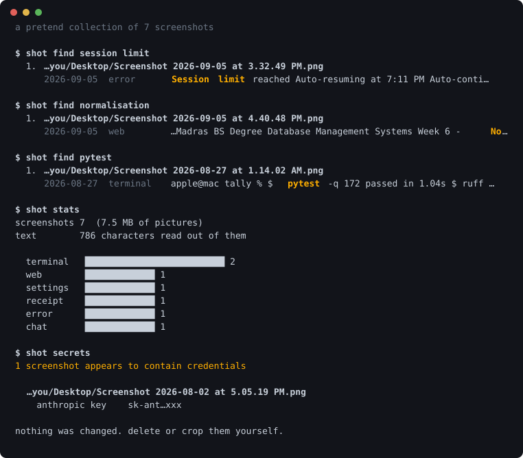

# shot

[](https://github.com/KRISH123no/shot/actions/workflows/ci.yml)



**Find a screenshot by what is written in it.** Reads every picture with the text engine already on
your Mac, indexes the words, and searches them. Names the files after their contents, groups the
ones that are the same picture, and tells you which ones have an API key in them.

Everything stays in one SQLite file on your machine. Nothing is uploaded, and there is nothing to
upload it to.

```bash
pip install -e ".[mac,dev]"
shot demo              # see what it does, no pictures needed
shot scan              # read Desktop and Downloads
shot find turnitin     # and then, forever

shot organise --from ~/Desktop        # show where they would be filed
shot organise --from ~/Desktop --apply  # → Screenshots/2026-09/2026-09-08 chat — dr sumit goswami.png
shot watch-install     # and from now on, automatically, as you take them
```

## Filing itself

`shot watch-install` puts a watcher behind your login. Press the shortcut, the file lands on the
Desktop, and a moment later it is in `Screenshots/2026-09/` under a name that says what it is. Your
Desktop stops filling up and you never think about it.

Two details that decide whether this works:

**A new screenshot is not a finished file.** macOS creates it and then writes it, and a picture read
in between is a truncated PNG that Vision refuses. So a new file is left alone until its size stops
changing.

**It polls rather than using FSEvents.** FSEvents delivers through a run loop, and a background
agent with no run loop never hears it — the exact failure that made a sister project report the
same application for nineteen days. A directory listing every three seconds costs nothing and
cannot go quietly stale.

```
shot organise
658 screenshots -> ~/Desktop/Screenshots/

  2024-03   422      2026-07    37
  2026-08    51      2026-09    10
```

**`--from` is not optional in practice.** A scan picks up every file named like a screenshot
anywhere it walked. On this machine 550 of 658 were inside an archive of class IX and X notes, filed
by hand years ago into folders like `class IX/FINALS/economy/Poverty`. Sweeping those into
folder-per-month would have destroyed real organisation to tidy a problem they were not part of. So
scope it to the folder where things are actually loose, and subfolders are excluded unless you ask.

Nothing moves without `--apply`. Nothing is ever overwritten: a name already taken gets `-2`, and if
the file already sitting there is byte-for-byte the same picture, the move is dropped instead — so
filing twice is a no-op rather than a duplicate.

## Why this works at all

macOS ships **Vision**, an on-device text engine. No key, no download, no account, and under a
second for a full-screen screenshot on an M1. That is the whole reason this is practical: a
collection of 647 screenshots takes about four minutes, once, on a laptop with seven gigabytes of
disk left.

Measured on a real collection: **647 screenshots, 561,297 characters of text**, 2.9 pictures a
second.

## The parts that are not obvious

**A screenshot's heading is the largest text near the top,** and Vision hands back a bounding box
for every line, so the geometry is free. Ranking lines by how title-shaped they are — big, high up,
confidently read, a sensible length, more than one word — is what turns
`Screenshot 2026-09-08 at 6.58.31 PM.png` into `2026-09-08 chat — dr sumit goswami.png`.

**Two files are the same in two different ways.** A digest catches the copy. It does not catch the
screenshot you took twice, three seconds apart, one of them with the cursor in it — those are
completely different bytes. So there is also a perceptual hash: shrink to nine pixels by eight in
grey, then set one bit per horizontal pair for whether the left is brighter than the right. Sixty
four comparisons, sixty four bits, and it survives rescaling because it records *relationships*
rather than values. On this collection: 19 sets of identical files, and 18 more sets that are the
same picture — including a burst of thirteen taken within four seconds.

**Reading the picture is the only expensive step, so nothing about it is thrown away.** The text,
the confidence and the position of every line are kept. That means every rule in this tool can be
improved and applied to everything already indexed without reading a single image again:

```
$ shot reclassify
reclassified 362 of 647 screenshots
```

That took under a second. Re-reading them would have taken four minutes, and I did it four times
while getting the rules right.

## Getting the rules right, on real data

The classifier is regexes, not a model, because a rule you can state is a rule you can debug — and
every one of these was wrong at first in a way the scores made obvious:

- **Three fifths of the collection came out as `terminal`.** The prompt pattern was `[$%>]` followed
  by whitespace, which matches `% S` in a percentage, `$ 9` in a price and `> 0` in a breadcrumb. A
  prompt now has to open a line and be followed by something that looks like a command.
- **Then `document` became the dumping ground at 55%,** because having more than twelve lines scored
  points on its own. A screenshot with fifty-eight lines of buttons and not one sentence in it was a
  document.
- **Then `unknown` was the plurality,** which was honest and useless. The missing category was
  `app` — most screenshots are of an interface: many short labels, barely a sentence. It scores
  below every specific signal, so it only catches what nothing else explains.
- **One clock is the menu bar.** Any full-screen screenshot has the time in the corner, so only the
  second timestamp onwards counts toward `chat`.

## Screenshots leak

You screenshot a terminal to send someone an error, and the `export` line above it goes too. Once
that picture is indexed, the key is searchable text in a database — so the tool that made that true
owes you a way to find them.

```
$ shot secrets
1 screenshot appears to contain credentials
  ~/Desktop/Screenshot 2026-08-02 at 5.05.19 PM.png
    anthropic key    sk-ant…xxx
```

Card numbers are checked against the Luhn checksum first, or every order number in every screenshot
is a card and nobody reads the warnings. Keys are shown masked. **Nothing is ever edited or deleted**
— a false positive that quietly damages a picture you needed is a far worse failure than one you
glance at and dismiss.

## What the tests check

```bash
pytest -q      # 218 tests, about a second
ruff check .
```

Only `ocr.py` needs a Mac. The rest — ranking, classification, naming, duplicate detection, the
query rewriter — is pure functions over dataclasses, so the interesting parts are tested by writing
out OCR results by hand, and CI runs on Linux as well as macOS.

Bugs the suite caught:

- **`sk-ant-…` was reported as an OpenAI key**, because the general pattern claimed the string
  before the specific one ran.
- **A picture containing the single word "meow" was classified as a chat**, because short lines
  scored on their own without any timestamps.
- **Two different files rendered as the same line** in the duplicate report, since paths were
  truncated from the left and these differed in the middle — in a list whose entire purpose is
  telling near-identical things apart.
- **A search snippet cut on a highlight boundary printed a bare `[]`.**

## A thing worth knowing about macOS

Screenshot filenames contain **U+202F**, a narrow no-break space, before the AM/PM. It is
indistinguishable from a space in every editor and terminal. A path copied out of `ls` will not
match the file it came from, and Python will tell you a file you are looking straight at does not
exist.

## Threads do not help much

`--jobs` exists and defaults to 4, but measured on 30 real screenshots it buys **11%**, not 4×:
11.7s single-threaded against 10.4s with four. Vision already uses the hardware; the work is not in
Python. The digest pass, which is file reading, does overlap — that is most of the 11%.

## Commands

| | |
|---|---|
| `shot scan [folders]` | read and index. `--screenshots` for only files named like one |
| `shot find <words>` | search. `--kind chat`, `-o` to open the top hit |
| `shot show <path>` | everything read out of one picture |
| `shot dupes` | identical files, and pictures that are the same picture |
| `shot secrets` | screenshots that appear to contain credentials |
| `shot rename [--apply]` | name files after what is in them |
| `shot reclassify` | apply improved rules to everything, without re-reading |
| `shot stats` · `prune` · `doctor` | what is indexed, tidying, and what this Mac can do |

Scanning again is cheap: unchanged files are skipped on size and mtime, and a file that was merely
renamed is recognised by its bytes and carried across rather than read a second time.

## Layout

| File | Lines | Role |
|---|---:|---|
| `cli.py` | 430 | the commands, and the terminal output |
| `index.py` | 337 | SQLite and FTS5, the query rewriter, migrations |
| `scanner.py` | 152 | walk, read, store — and skipping as much as possible |
| `ocr.py` | 142 | the only file that knows this is a Mac |
| `classify.py` | 114 | what kind of screenshot is this |
| `walk.py` | 110 | finding pictures without walking the whole disk |
| `naming.py` | 100 | choosing a name from the geometry of the text |
| `hashing.py` | 100 | two kinds of sameness |
| `demo.py` `secrets.py` `model.py` | 251 | a pretend collection, credentials, the three types |

2,329 lines of implementation, 1,385 of tests.

## Not implemented

- **macOS only.** `ocr.py` is 142 lines against Apple's Vision. A Linux port means Tesseract, which
  is a download, slower, and worse on interface text.
- **`~/Pictures` is not scanned by default.** Six thousand photographs, no text worth searching, two
  hours of reading, and a searchable index of somebody's birthday party. Pass the path if you want it.
- **No handwriting, and no tables.** Vision reads printed text in lines. A screenshot of a
  spreadsheet comes back as words with the columns lost.
- **English by default.** `Engine(languages=[...])` takes others; nothing exposes it on the command
  line yet.
- **No watching.** New screenshots are found the next time you scan, not the moment you take one.
- **The classifier is rules.** It will be wrong about your screenshots in ways it is not wrong about
  mine, and the honest fix is to edit the regexes and run `shot reclassify`.

## Licence

MIT.
